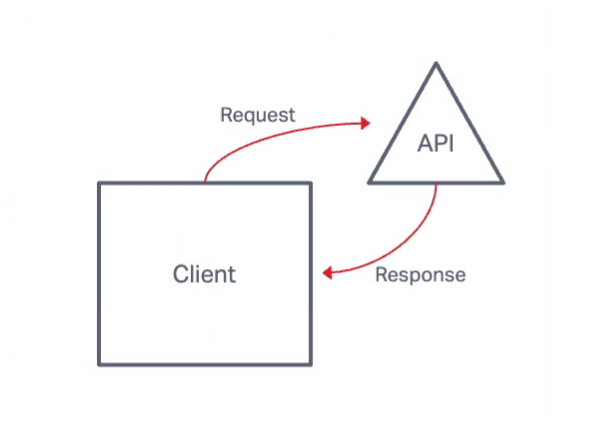
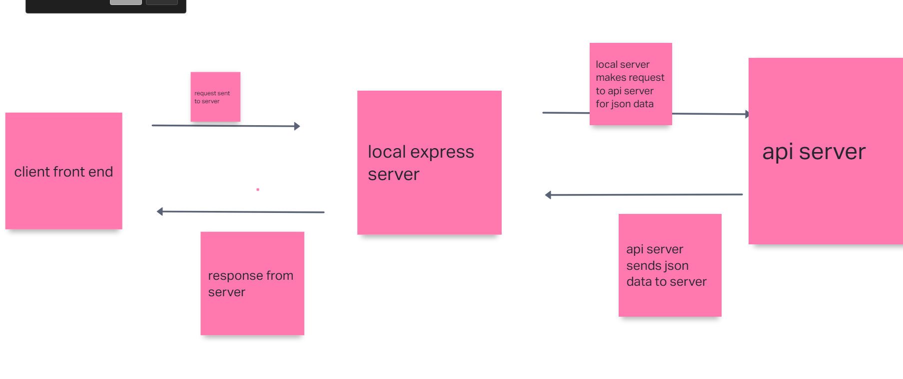
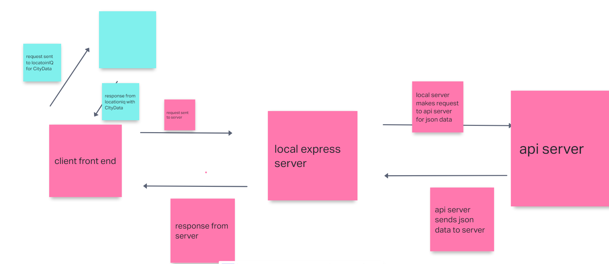
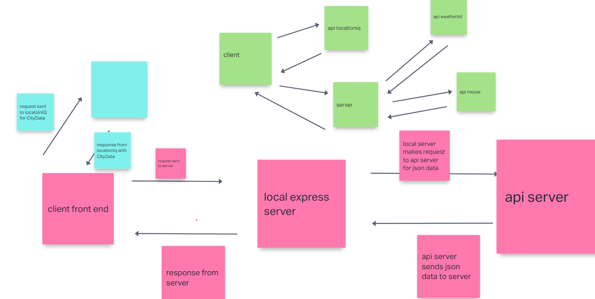
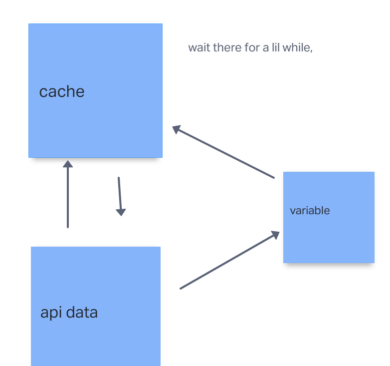

# Project Name

**Author**: Anthony Sinitsa

## Overview

This repository contains the frontend code for the City Explorer project. It utilizes a weather api to retrieve the weather from the city that the user has input. (API key expired, will not show weather unfortunately)

- Languages:

  - The project is written in JavaScript using React framework for the frontend.

- Utilities/Dependencies:

  - axios: Used for making HTTP requests.

  - bootstrap: Provides styling and components.

  - react-bootstrap: Integrates Bootstrap with React components.

  - react-dom: Renders React components into the DOM.

  - react-scripts: Scripts for managing the React project.

- Files:

  - src/: Contains the main source code files for the project.

  - public/index.html: Main HTML file for the React application.

  - public/manifest.json: Configuration file for the web app manifest.

  - src/App.js: Main component handling state and rendering.

  - src/Weather.js: Component for displaying weather information.

  - src/Movie.js: Component for displaying movie information.

  - src/WeatherDay.js: Component for displaying weather for a specific day.

  - src/MovieDay.js: Component for displaying movie details for a specific day.

  - src/index.js: Entry point for rendering the React app.

  - src/index.css: Styling for the index file.

### Diagrams

